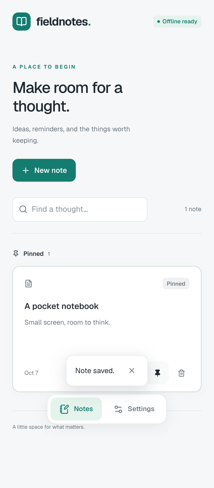

# my-vue-pwa-starter

A Vue PWA starter with your own UI library, Histoire, and feature-based ports and adapters. The included Fieldnotes app saves notes on your device with native IndexedDB and works offline after its first successful load.

[Try the live PWA](https://alexanderop.github.io/my-vue-pwa-starter/) on your phone. On iPhone, open it in Safari and use Share → Add to Home Screen. On Android, use your browser’s Install app or Add to Home screen action. Load it once online before trying offline mode.

## Run locally

Use Node.js 22.12 or newer and pnpm 10.28.2.

```sh
pnpm install
pnpm dev
```

Open http://127.0.0.1:4173. Create a note to try the example feature. Deleted notes go to Trash and can be restored. Settings offers JSON backup export and import; imports add copies without replacing existing notes. Backups support up to 5,000 notes and 10 MB.

To explore the production UI components in Histoire:

```sh
pnpm dev:ui
```

Open http://localhost:6006. Stories use the same components as the application.



## Workspace

| Package                | Responsibility                                                                                                                                  |
| ---------------------- | ----------------------------------------------------------------------------------------------------------------------------------------------- |
| `apps/playground`      | Fieldnotes PWA, feature composition, native IndexedDB, installation, updates                                                                    |
| `packages/ui`          | `@starter/ui`, design tokens, reusable Vue components, Histoire stories                                                                         |
| `packages/result`      | `@starter/result`, typed `Result` values vendored from better-result                                                                            |
| `packages/composables` | `@starter/composables`, small dependency-free Vue composables for events, media queries, connectivity, visibility, and validated `localStorage` |

The UI package exports Vue source for Vite consumers within this workspace. It is private and does not require an npm release. Applications import components from `@starter/ui` and styles from `@starter/ui/styles.css`.

```vue
<script setup lang="ts">
import { UiButton } from '@starter/ui'
</script>

<template>
  <UiButton>Save note</UiButton>
</template>
```

## Stack

Vue 3, strict TypeScript, Vite, Vue Router, Tailwind CSS, Reka UI, Lucide, Histoire, native IndexedDB, Valibot, and vite-plugin-pwa. Tests use Vitest, Vitest Browser Mode with vitest-browser-vue, and Playwright. Oxlint and Vue ESLint rules check code; Prettier formats it.

Histoire currently requires Vite 7.3. TypeScript 6 stays within the Vue and ESLint tooling compatibility range. The lockfile records the verified versions. No backend, account, Dexie, state container, or DI container is required.

## Verify changes

```sh
pnpm verify
pnpm test:unit
pnpm exec playwright install chrome
pnpm test:browser
pnpm build
pnpm test:e2e
```

`pnpm verify` checks types, lint, import boundaries, and formatting. Unit tests cover pure rules and application outcomes. Browser tests exercise real IndexedDB and component interaction. Playwright runs executable Gherkin scenarios against production builds, including offline navigation and a real upgrade between two service-worker versions. See [verification evidence](docs/verification.md) for the executed journeys and review limits. The test server's version-control endpoint exists only in `scripts/serve-e2e.mjs`.

Histoire is an interactive component workshop. Its stories do not replace automated browser tests.

## Use the starter

Create a repository from this GitHub template, then rename the application, workspace scope, database name, and manifest metadata. Replace the example notes feature with your product features. Keep application wiring in `app` and import reusable UI through the package entry point.

Read [the architecture](docs/architecture.md) for dependency rules. [The implementation plan](docs/implementation-plan.md) and [decision trail](docs/decisions.tsv) record the initial build and verification.

## PWA behavior

The service worker caches application assets. IndexedDB stores notes separately. Updates wait for an explicit action, and an open dirty editor or a pending write prevents an update from reloading the app. Installation is optional and depends on browser support.

Use a production preview to test the service worker:

```sh
pnpm build:app
pnpm --filter @starter/playground preview
```

Host the build over HTTPS, or localhost for development. Hash routing lets application routes reload on static hosts without rewrite rules. Browser storage can be cleared or evicted; this starter does not provide cloud backup or synchronization.

## GitHub Pages

The CI workflow deploys the app to GitHub Pages after all checks pass on `main`. In a repository created from this template, enable **Settings → Pages → Source → GitHub Actions**. The workflow derives the base path from Pages, so repository subpaths and custom domains work without changing application code. Histoire remains a separate local/build artifact.

Check a deployed site in an isolated mobile Chrome session:

```sh
node scripts/verify-deployment.mjs https://alexanderop.github.io/my-vue-pwa-starter/
```

This checks the deployment path, service-worker scope, mobile layout, route reloads, and offline reads and writes. Notes created by the check stay in its temporary browser session.

## Error handling

Expected failures are return values, not exceptions. Repositories and services return `Result<T, E>` from `@starter/result`, and the UI checks `result.isErr()` before reading `result.value`. `Result.gen` composes steps in order and stops at the first error; `Result.tryPromise` turns a thrown exception into a typed error at the service boundary.

Backup import and export show the full pattern. `features/notes/domain/backup.ts` defines one `TaggedError` class per failure, `importBackup` chains the size check, file read, JSON parse, validation, and write with `Result.gen`, and `SettingsPage.vue` turns the outcome into a message with `.match` and `matchError`. TypeScript rejects the page if a new backup error has no message.

## Credits

`packages/result` is a copy of [better-result](https://github.com/dmmulroy/better-result) 3.0.1 by [Dillon Mulroy](https://github.com/dmmulroy), including its test suite and MIT license. The library has no runtime dependencies; it is vendored so the starter owns and reviews the code it ships. See [packages/result/README.md](packages/result/README.md) for the upstream commit and update steps.

`packages/composables` contains small composables adapted from [VueUse](https://github.com/vueuse/vueuse) (MIT, Anthony Fu and contributors), reduced to a client-only PWA and returning `Result` values where storage can fail.

## Design reference

[Tilly](https://github.com/carlassmann/tilly) inspired the restrained colors, rounded controls, responsive navigation, and PWA interaction patterns. The Vue components and starter implementation are original. Geist and Lucide retain their respective package licenses.

## License

MIT.
